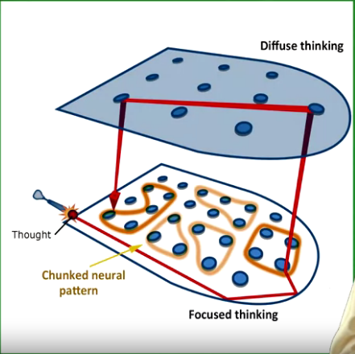

# Learning How to Learn - Week 4

## Things that make us human
- Learning
- Language
- Planning

- Visual Cortex - matures in childhood
- Prefrontal Cortex - matures in puberty

## Quotes
- We can make significant changes in our brain by changing how we think.
- **Taking responsibility of our own learning is one of the most important things we can do.**
- Virtue of the less brilliant: perseverance
- "The first principle is that you must not fool yourself- and you are the easiest person to fool." - Richart Feynman

## Right hemisphere
- big picture thinking, context-dependent thinking style are significantly more characteristic to result in **right hemisphere dominance**
- Acc to neuroscientist, Vilayanur S. Ramachandran - the right hemisphere serves as a devil's advocate to question the status quo and look for global inconsistencies, while the left hemisphere clings to the way things were

## How to prepare for a test: Test Checklist (developed by Richard Felder)
1. Did you make a serious effort to understand the text?
2. Did you work with classmates on homework problems?
3. Did you attempt to outline every homework problem solution?
4. Did you participate actively in homework group discussions?
5. Did you consult with the instructor?
6. Did you understand all of your homework problem solutions?
7. Did you ask in class for explanations of homework problem solutions that weren't clear to you?
8. A study guide?
9. Did you attempt to outline lots of problem solutions quickly?
10. Did you go over the study guide and problems with classsmates and quiz one another?
11. A review session?
12. Did you get a reasonable night's sleep before the test?

## Notes
- Consulting with your peers/ talking to them about what you're studying helps build your understanding and can help you in catching where your thinking has gone astray.
- When you receive a test paper:
    1. Skim the test paper
    2. Work on the difficult problem
        - if stuck for at least 1 minute, move on to easier problems
    3. Answer easy problems
    4. Get back to difficult problems
- Cortisol is produced when you're under stress while taking an exam (sweaty palms, racing heart)
    - It's how you view/interpret the stress that matters
        - Stress -> "This test makes me afraid" -> You'll be afraid
        - Stress -> "This test makes me excited"
        -> You'll be more fired up to take on the exam
- Practice deep breathing
- Always recheck your work, even after you're "done" with it. Through **overconfidence**, it might be that you fool yourself that what you've done is correct even if it isn't. Pause. Shift your attention and ask yourself a question "Does this really make sense?"

## Summary 
- Santiago Ramón y Cajal (Noble prize winner, neuroscientist) - If you change your thoughts, you can really truly change your life.

## Diffused-Focused thinking analogy pic
